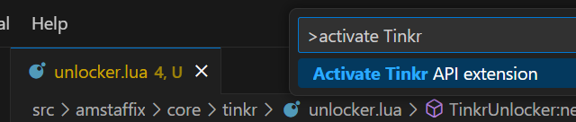

# Tinkr Lua API

A Visual Studio Code extension that provides Lua library definitions for [**Tinkr**](https://tinkr.site/), enabling IntelliSense, autocompletion, and type checking for Tinkr-specific APIs.

[Join Discord](https://discord.gg/4mETWj9Wmb) to discuss and participate.

## Instructions

- Press `CTRL + SHIFT + P` to open the command palette
- type `Activate Tinkr API extension` and press enter



## Example
Here’s an example of how to use Tinkr APIs with autocompletion and type checking:

```lua
---@type Tinkr
local tinkr = ...

-- Use Tinkr APIs with IntelliSense support
local x, y, z = tinkr.GetCorpsePosition(x, y, z) -- Autocompletion and type checking will work here
```

## Requirements

- [Lua VSCode extension](https://marketplace.visualstudio.com/items?itemName=sumneko.lua)  must be installed for this extension to work.

## Contributing

Contributions are welcome! If you have any ideas, suggestions, or issues, please open an issue or submit a pull request.

1. Fork the repository.
2. Create a new branch (`git checkout -b feature/YourFeatureName`).
3. Commit your changes (`git commit -m 'Add some feature'`).
4. Push to the branch (`git push origin feature/YourFeatureName`).
5. Open a pull request.

## License

This project is licensed under the MIT License. See the [LICENSE](https://github.com/WoW-U/vscode-tinkr-api/blob/main/LICENSE) file for details.

---

## Acknowledgements

- [Lua VSCode extension](https://marketplace.visualstudio.com/items?itemName=sumneko.lua) for providing excellent Lua support in VS Code.
- [Visual Studio Code](https://code.visualstudio.com/) for the awesome editor and extension API.

---

Enjoy using Tinkr Lua API! If you have any questions or feedback, feel free to [open an issue](https://github.com/WoW-U/vscode-tinkr-api/issues).
